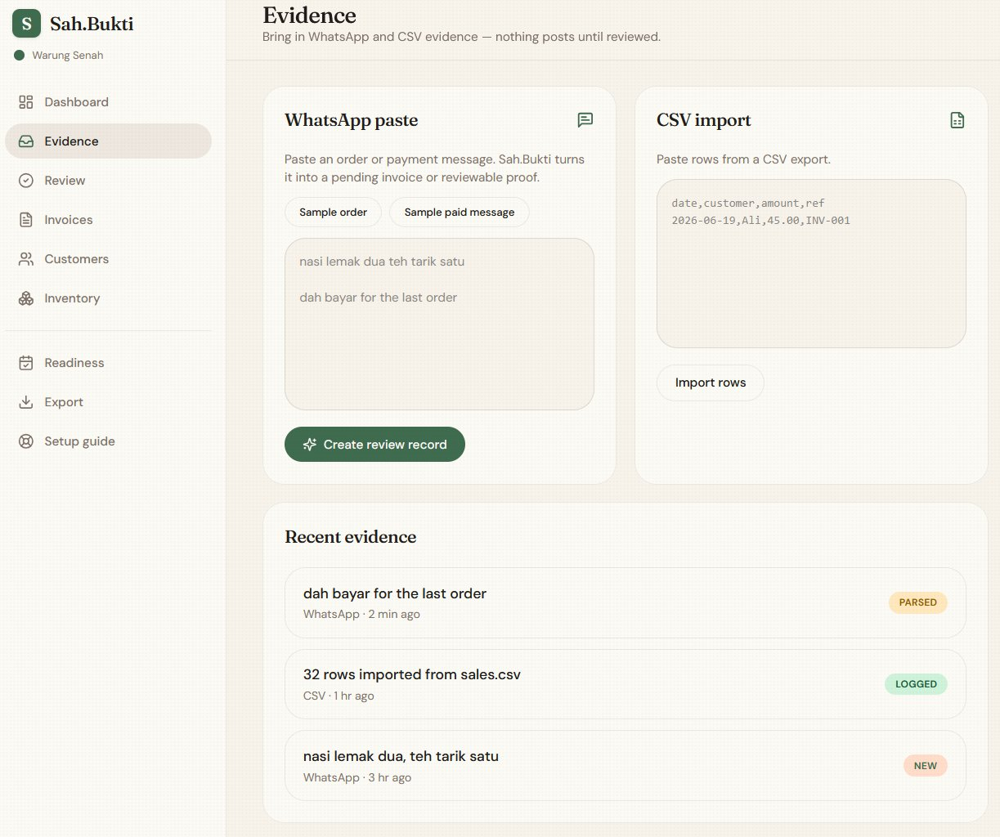
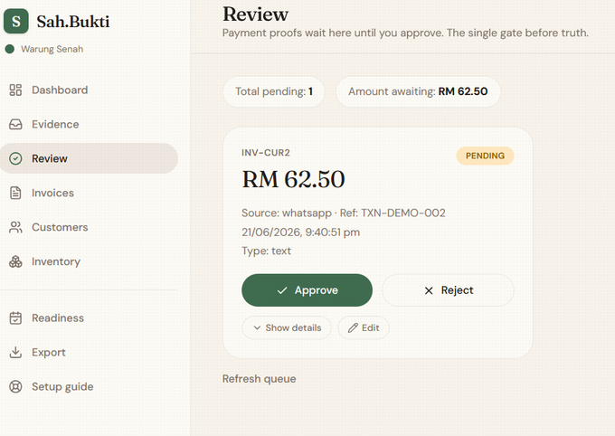
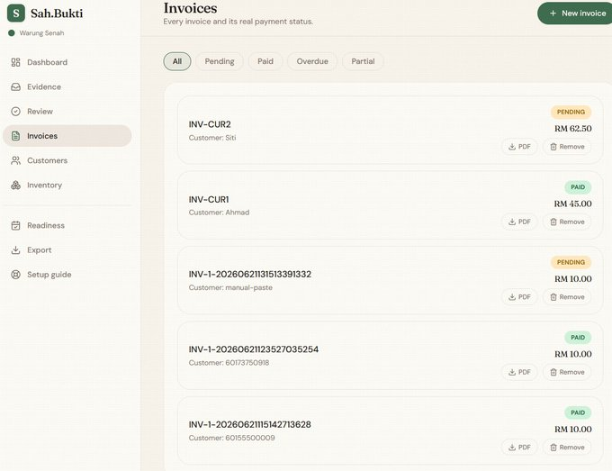
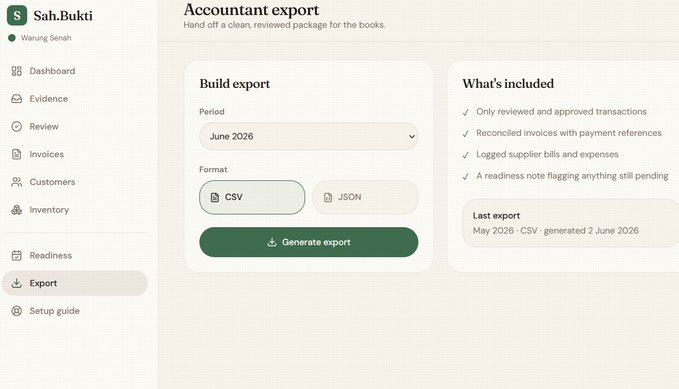

# Sah.Bukti

Proof before payment. Clean books after.

Sah.Bukti is a WhatsApp-first collections control plane for Malaysian micro-sellers. It turns messy order and payment messages into structured evidence, routes them through review, and updates ledger truth only after owner approval.

Live product: `https://arifaqyl.me/frontend/`

Built as a focused operations product for Malaysian micro-sellers, not a generic SaaS wrapper.

## Core Flow

```text
WhatsApp message or imported evidence
        ->
structured invoice or payment proof
        ->
review queue
        ->
owner approval
        ->
ledger update
        ->
accountant export
        ->
month-end readiness
```

## What It Does

- Captures order text and payment intent as structured records
- Keeps payment proofs in `needs_review` until an owner approves
- Tracks invoices, customers, reminders, stock notes, and exports in one backend
- Generates accountant-ready exports and month-end provision outputs
- Serves a React frontend from the FastAPI app

## Product Screens

| Evidence intake | Review gate |
| --- | --- |
|  |  |

| Invoices | Accountant export |
| --- | --- |
|  |  |

## Trust Boundary

- Inbound evidence never marks an invoice paid by itself
- Payment-like input creates reviewable proof, not confirmed payment
- Approval is the only mutation path for ledger truth
- Export and readiness surfaces reflect approved state only

## What It Is Not

- Not a generic chatbot
- Not a full accounting suite
- Not an ERP
- Not an autonomous bookkeeping agent

## Stack

- FastAPI
- SQLite
- React + Vite frontend
- WAHA-compatible WhatsApp integration

## Repository Layout

```text
app/        FastAPI routes, schemas, services, database init
client/     React/Vite frontend source
frontend/   Built frontend assets served by FastAPI
docs/       Product, architecture, security, and build notes
scripts/    Local utilities and bridge scripts
tests/      Backend test suite
```

## Run Locally

Backend:

```powershell
cd D:\kedai-ops
.\.venv\Scripts\Activate.ps1
python -m uvicorn app.main:create_app --factory --host 0.0.0.0 --port 8000
```

Frontend source build:

```powershell
cd D:\kedai-ops\client
pnpm install
pnpm build
```

Optional local WhatsApp bridge:

```powershell
cd D:\kedai-ops
npm install
node scripts/whatsapp_bridge.js
```

Open:

```text
http://127.0.0.1:8000/frontend/
```

## Node Tooling Notes

- You do not need Node to run the FastAPI backend.
- `client/` is the real frontend workspace and uses `pnpm`.
- The root `package.json` is only for the optional local WhatsApp bridge.
- If you only want the product backend and served frontend, use Python plus the already-built `frontend/` assets.

## Tests

```powershell
cd D:\kedai-ops
.\.venv\Scripts\python.exe -m pytest -q tests
```

## Documentation

- [Problem and product scope](docs/problem-and-scope.md)
- [Architecture](docs/architecture.md)
- [Trust and safety](docs/trust-and-safety.md)
- [Challenges and decisions](docs/challenges-and-decisions.md)
- [Repository structure](docs/repository-structure.md)

## License

MIT
